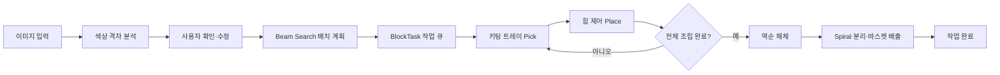
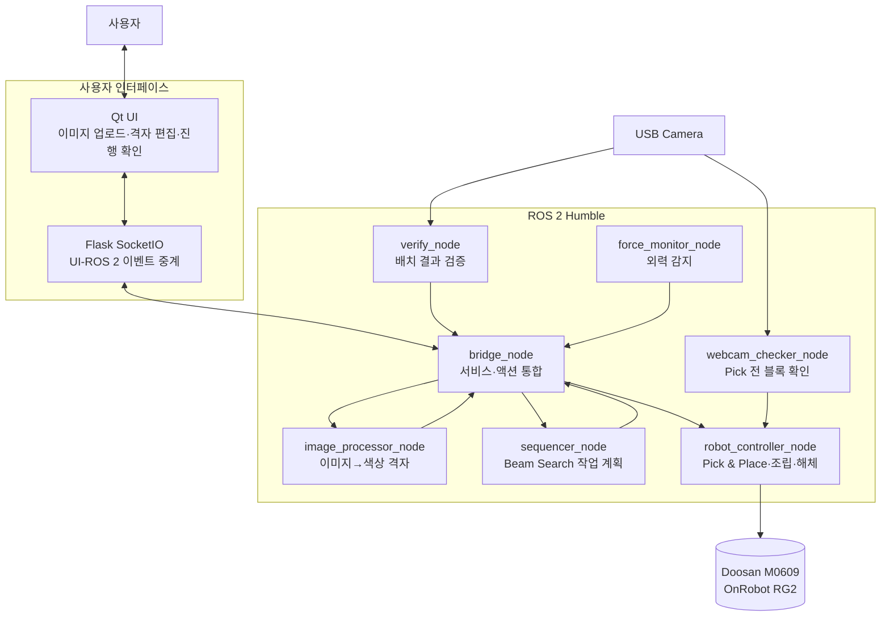

# LEGO 블록 자동 조립·해체 시스템


사용자가 입력한 이미지를 색상 격자로 변환해 LEGO 조립 도안을 만들고, 두산 M0609 협동로봇이 키팅 트레이의 블록을 가져와 도안대로 **조립한 뒤 역순으로 해체·배출**하는 시스템입니다.

`Qt UI → Flask SocketIO → ROS 2 → Doosan M0609` 구조로 이미지 분석, 조립 순서 생성, 로봇 작업 실행과 진행 상태 관리를 연결했습니다.

## 실행 영상

[](https://youtu.be/4dupj63IoR0)

> 이미지를 클릭하면 YouTube 실행 영상으로 이동합니다.

## 프로젝트 요약

| 항목 | 내용 |
|:---|:---|
| 개발 기간 | 2026.06.17 ~ 2026.06.30 |
| 개발 형태 | 3인 팀 프로젝트 |
| 목표 | 입력 이미지 기반 LEGO 도안 생성과 실물 협동로봇 조립·해체 자동화 |
| 시스템 구성 | Qt UI · Flask SocketIO · 이미지 분석 · 배치 계획 · 로봇 제어 · 조립 검증 |
| 사용 장비 | Doosan Robotics M0609 · OnRobot RG2 · USB 카메라 |
| 반복 시험 | 블록 결합 95/100회, 해체 16/20회 성공 |

## 핵심 기능

### 1. 입력 이미지 기반 조립 도안 생성

- 입력 이미지를 블록 비율에 맞는 색상 격자로 양자화합니다.
- 사용자는 UI에서 분석 결과를 확인하고 색상 셀을 수정할 수 있습니다.
- 격자 결과를 실제 키팅 블록의 색상과 크기에 대응시킵니다.

### 2. 블록 배치 순서 계획

- 동일 색상 셀을 행 단위의 연속 구간으로 묶습니다.
- 2×2·3×2 블록 조합을 생성하고 Beam Search로 배치 후보를 탐색합니다.
- 아래층에서 위층, 왼쪽에서 오른쪽 순으로 `BlockTask[]` 작업 큐를 생성합니다.

### 3. 실물 협동로봇 Pick & Place

- 색상과 블록 유형에 따라 키팅 트레이의 고정 Pick 좌표를 선택합니다.
- 관절 이동과 직선 이동을 작업 구간에 맞게 분리합니다.
- 안전 고도, 접근 위치, 파지 위치와 배치 위치를 단계별로 관리합니다.
- RG2 Digital I/O 상태를 확인한 뒤 다음 동작으로 전이합니다.

### 4. 힘 제어 기반 조립

- 블록 삽입 구간에서 Z축 컴플라이언스와 목표 힘을 적용합니다.
- 힘을 유지한 상태에서 작은 Spiral 동작으로 XY 오차를 흡수합니다.
- 고정 좌표의 미세 오차로 블록이 스터드에 걸리는 문제를 줄였습니다.

### 5. 역순 해체와 개별 블록 배출

- 조립한 블록 목록을 기록하고 마지막에 배치한 블록부터 역순으로 해체합니다.
- 파지 후 단계적으로 Spiral 동작을 수행해 목표 블록 하나만 분리합니다.
- 위쪽 블록 제거로 아래 블록의 결합이 약해질 수 있어, 다음 블록은 해체 전에 한 번 더 눌러 결합 상태를 복원합니다.
- 분리한 블록은 안전 고도로 들어 올린 뒤 지정 바스켓에 배출합니다.

## 시스템 흐름



## 시스템 아키텍처



## 노드 구성

| 노드 | 인터페이스 | 역할 |
|:---|:---|:---|
| `bridge_node` | SocketIO · ROS 2 Client | UI 요청을 이미지 분석·계획·로봇 실행 흐름으로 연결 |
| `image_processor_node` | `/image/analyze` Service | 입력 이미지를 색상 격자와 블록 후보로 변환 |
| `sequencer_node` | `/sequence/plan` Service | 격자에서 블록 조합과 배치 순서를 생성 |
| `robot_controller_node` | `/execute_queue` Action | Pick & Place, 조립, 역순 해체와 작업 상태 관리 |
| `verify_node` | `/vision/expected_model` Topic | 예상 도안과 카메라 결과 비교 |
| `camera_node` | `/front_camera/image_raw` Topic | 정면 카메라 영상 발행 |
| `webcam_checker_node` | `/webcam/check_block` Service | Pick 전 블록 존재 여부 확인 |
| `force_monitor_node` | `/robot/force_detected` Topic | DRFL을 이용한 외력 감지 |

## 핵심 구현 상세

### 이미지에서 블록 작업 큐까지

1. `image_processor_node`가 이미지를 지정 격자로 맞춥니다.
2. 팔레트에 정의된 색상으로 각 셀을 양자화합니다.
3. 사용자가 UI에서 색상 격자를 확인하거나 수정합니다.
4. `sequencer_node`가 같은 색상의 연속 구간을 2칸·3칸 블록 조합으로 분할합니다.
5. Beam Search가 층간 블록 경계를 고려해 누적 손실이 낮은 후보를 선택합니다.
6. 각 블록을 `color`, `block_type`, `y_position`, `layer`로 구성된 작업으로 변환합니다.

### 힘 제어 조립

고정 좌표만으로 블록을 삽입하면 미세한 위치 오차 때문에 스터드 위에서 걸리거나 한쪽만 결합될 수 있습니다. 이를 다음 순서로 처리했습니다.

```text
배치 위치 상부 이동
→ 고속 접근
→ 저속 하강
→ Z축 컴플라이언스·목표 힘 적용
→ 힘을 유지한 Spiral 미세 정렬
→ RG2 Release
→ 안전 고도 복귀
```

### Spiral 해체와 결합 복원

여러 층으로 결합된 LEGO를 단순히 위로 당기면 목표 블록과 아래 블록이 함께 들리거나 주변 결합이 약해졌습니다.

```text
해체 대상 접근
→ 이전 해체의 영향을 받은 블록 사전 눌림
→ 동일 배치 좌표에서 파지
→ 단계적 Spiral로 결합 해제
→ 수직 인출
→ 바스켓 이동·배출
```

- `pre_press=(stack_index > 0)` 조건으로 아래층 블록의 결합을 먼저 복원합니다.
- Spiral의 회전 수·반경·Z 이동량을 단계적으로 적용해 개별 블록 분리 안정성을 높였습니다.
- 해체는 조립 역순으로 수행해 위층이 남아 있는 상태에서 아래층을 당기는 상황을 방지했습니다.

### 작업 상태와 실패 처리

- 실행 중인 Queue가 있으면 새 Goal을 거부합니다.
- 빈 작업, 잘못된 색상, NaN/Inf 좌표는 실행 전에 차단합니다.
- Action Feedback으로 현재 작업 인덱스를 UI에 전달합니다.
- Pause/Resume 서비스는 별도 Executor에서 처리해 로봇 동작 Callback 중에도 응답할 수 있게 했습니다.
- 취소·실패 시 Action 상태와 오류 발생 단계를 반환하고 `finally`에서 Busy 상태를 해제합니다.

## 문제와 해결

| 문제 | 원인 | 해결 |
|:---|:---|:---|
| 블록 삽입 실패 | 고정 좌표와 실제 스터드 중심의 미세 오차 | Z축 힘 제어와 작은 Spiral 정렬 적용 |
| 목표 블록만 분리되지 않음 | LEGO 결합력과 수직 인출 저항 | 파지 후 단계적 Spiral 해체 적용 |
| 다음 블록의 결합 약화 | 위쪽 블록을 뽑을 때 아래쪽 결합도 함께 느슨해짐 | 다음 해체 전에 힘 제어로 한 번 더 눌러 결합 복원 |
| 작업 중 UI 제어 지연 | Action Callback이 로봇 동작을 동기 실행 | Pause 서비스를 별도 Executor·Thread로 분리 |
| 중복 작업 실행 | 이전 Queue 실행 중 새 Goal 수신 | Busy Lock과 Goal 유효성 검사로 실행 차단 |

## 구현·검증 결과

| 시험 항목 | 결과 | 확인 내용 |
|:---|:---:|:---|
| LEGO 결합 | 95/100회 | 힘 제어와 Spiral 보조 적용 후 반복 결합 |
| LEGO 해체 | 16/20회 | 역순 해체와 개별 블록 배출 |
| 작업 상태 | 구현 완료 | Goal 거부, Pause/Resume, Cancel, 실패 단계 반환 |
| 전체 연동 | 구현 완료 | 이미지 입력 → 계획 → 조립 → 해체 흐름 연동 |

실패 사례는 좌표 편차, 파지 상태와 블록 결합력에 따라 분류하고, 좌표·힘·속도·Spiral 파라미터를 반복 보정했습니다.

## 기술 스택

| 구분 | 기술 |
|:---|:---|
| OS | Ubuntu 22.04 LTS |
| Middleware | ROS 2 Humble Hawksbill |
| Language | Python 3.10 |
| Robot | Doosan Robotics M0609 |
| Gripper | OnRobot RG2 |
| Robot API | DSR_ROBOT2 · DRFL · DR_common2 |
| Vision | OpenCV · cv_bridge · USB Camera |
| UI | PySide6 Qt · Flask · Flask-SocketIO |
| Communication | ROS 2 Service · Action · Topic · SocketIO |

## 주요 ROS 2 인터페이스

| 종류 | 이름 | 타입 | 용도 |
|:---|:---|:---|:---|
| Service | `/image/analyze` | `ProcessMosaic` | 이미지 색상 격자 분석 |
| Service | `/sequence/plan` | `SequencePlan` | 블록 배치 작업 생성 |
| Action | `/execute_queue` | `Assembly` | 작업 큐 실행과 진행 Feedback |
| Service | `/robot/pause` | `SetBool` | 로봇 작업 일시정지·재개 |
| Service | `/webcam/check_block` | `CheckBlock` | Pick 전 블록 존재 확인 |
| Topic | `/vision/expected_model` | `ExpectedModel` | 검증용 예상 조립 도안 |
| Topic | `/webcam/error` | `WebcamError` | 조립 검증 오류 |
| Topic | `/robot/force_detected` | `Bool` | 외력 감지 상태 |

## 프로젝트 구조

```text
rokey_proj_01/
├── src/
│   ├── cobot1/
│   │   ├── cobot1/
│   │   │   ├── bridge_node.py
│   │   │   ├── image_processor_node.py
│   │   │   ├── sequencer_node.py
│   │   │   ├── robot_controller_node.py
│   │   │   ├── spiral_detach_discard.py
│   │   │   ├── verify_node.py
│   │   │   ├── camera_node.py
│   │   │   ├── webcam_checker_node.py
│   │   │   └── force_monitor_node.py
│   │   ├── config/
│   │   └── launch/assembly.launch.py
│   ├── cobot1_interfaces/
│   │   ├── action/Assembly.action
│   │   ├── msg/BlockTask.msg
│   │   └── srv/
│   ├── flask_app/
│   └── qt_app/
├── docs/
├── README.md
└── LICENSE
```

<details>
<summary><strong>개발 환경과 장비</strong></summary>

### 소프트웨어 환경

- Ubuntu 22.04 LTS
- ROS 2 Humble
- Python 3.10
- OpenCV, NumPy, PyYAML
- Flask, Flask-SocketIO
- PySide6, python-socketio

### 장비

| 장비 | 수량 | 용도 |
|:---|:---:|:---|
| Doosan Robotics M0609 | 1 | LEGO Pick & Place·조립·해체 |
| OnRobot RG2 | 1 | 블록 파지·배출 |
| USB Camera | 1 | 이미지 분석 및 조립 결과 확인 |
| 키팅 트레이 | 2 | 색상·유형별 LEGO 공급 |
| ROS 2 PC | 1 | 노드·UI·로봇 드라이버 실행 |

</details>

<details>
<summary><strong>빌드와 실행 방법</strong></summary>

### 1. 워크스페이스 빌드

```bash
source /opt/ros/humble/setup.bash
colcon build --symlink-install
source install/setup.bash
```

### 2. 두산 로봇 드라이버

```bash
ros2 launch m0609_rg2_bringup bringup.launch.py \
  mode:=real \
  host:=192.168.1.100 \
  model:=m0609
```

### 3. Flask SocketIO

```bash
python3 src/flask_app/app.py
```

### 4. ROS 2 노드

```bash
ros2 launch cobot1 assembly.launch.py
```

### 5. Qt UI

```bash
python3 src/qt_app/main.py
```

</details>

<details>
<summary><strong>실행 전 확인 사항</strong></summary>

장비가 바뀌면 다음 설정을 현재 환경에 맞게 수정해야 합니다.

1. `force_monitor_node.py`의 DRFL 공유 라이브러리 경로
2. `config/usb_camera.yaml`의 카메라 by-id 경로
3. `launch/assembly.launch.py`의 웹캠 장치 경로
4. M0609 Controller IP와 Tool/TCP 설정
5. 키팅 트레이와 조립 위치의 실제 좌표

하드웨어를 구동하기 전에 낮은 속도로 Dry Run을 수행하고, 비상정지와 작업 영역을 확인해야 합니다.

</details>

## 한계와 개선 방향

### 현재 구현

- 정해진 키팅 트레이와 조립 위치에서 이미지 기반 도안의 조립·해체를 수행합니다.
- 실제 M0609·RG2 환경에서 Pick & Place와 힘 제어 동작을 반복 검증했습니다.
- 카메라·UI·계획·로봇 제어 노드를 ROS 2 인터페이스로 연결했습니다.

### 개선 방향

- Hand-Eye Calibration을 적용해 고정 좌표 보정 절차 자동화
- 조립 중 실시간 시각 검증과 오차 발생 블록만 재작업하는 복구 Queue 구현
- 힘·위치 로그를 이용한 블록 유형별 삽입 파라미터 자동 보정
- 해체 실패 시 파지 상태를 재확인하고 Spiral 조건을 단계적으로 변경하는 재시도 정책

## 관련 문서

- [시스템 통합 가이드](docs/integration-guide.md)
- [Sequencer 설계](docs/sequencer-spec.md)
- [Webcam Block Checker 설계](docs/specs/2026-06-27-webcam-block-checker-design.md)

## License

이 프로젝트는 [MIT License](LICENSE)를 따릅니다.
